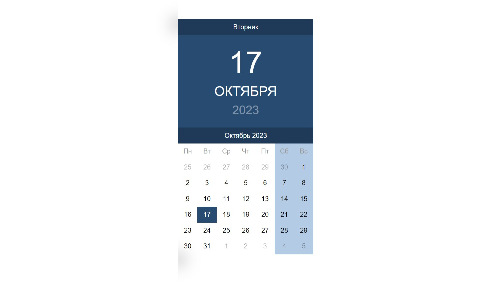

# calendar
### Ссылка на прототип:

https://vobiryukov12.github.io/calendar/

## Preview

## Описание
Мини-приложение на React, которое показывает текущую дату, месяц и год. Для реализации не использовались сторонние библиотеки, только встроенный объект Date.

##### Особенности проекта:
Если месяц начинается не с понедельника, то показываются даты предыдущего месяца в этой неделе и выделяются серым цветом. Аналогично, если месяц заканчивается не в воскресенье, то добавляются даты следующего месяца и так же помечаются серым цветом.

##### Технологии используемые на проекте:  

